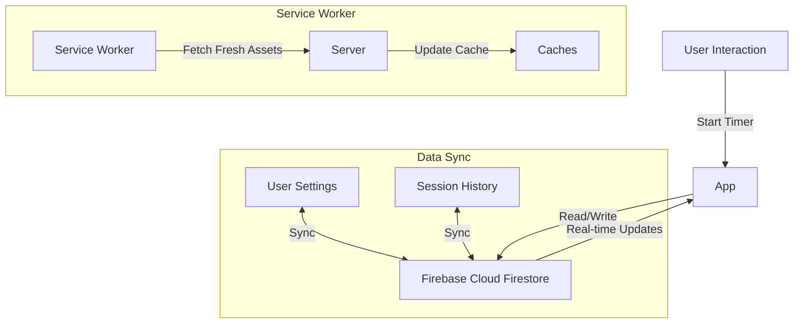
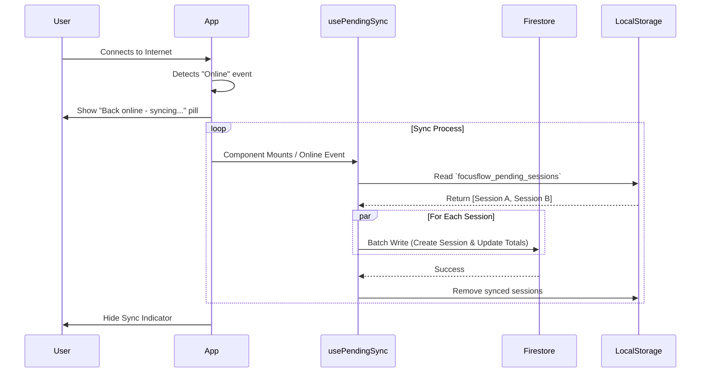

# FocusFlow Offline & Online Workflow

This document outlines how FocusFlow handles data consistency, user experience, and synchronization across Online and Offline states as a Progressive Web App (PWA).

## 1. System Overview

FocusFlow is a "Local-First" PWA. It prioritizes immediate user interaction by using local storage and Firestore's offline persistence layer, ensuring the app feels responsive regardless of network status.

### Key Components
*   **Service Worker (`public/sw.js`):** Intercepts network requests to serve cached assets (HTML, CSS, JS) when offline.
*   **Firestore Offline Persistence:** Automatically caches database reads/writes in IndexedDB.
*   **Pending Session Queue (`usePendingSync`):** A custom mechanism to store completed timer sessions in `localStorage` if Firestore is unreachable.
*   **User Preferences:** Stored in `localStorage` for instant load, then synced to Firebase.

---

## 2. Online Mode Flow

When the user is connected to the internet, the app writes directly to the server but keeps a local backup for speed.



### Behavior
*   **Authentication:** User logs in via Google/GitHub.
*   **Data writes:** Timer sessions and setting changes are sent directly to Firestore.
*   **Updates:** The app listens for real-time changes from other devices.

---

## 3. Offline Mode Flow

When the internet cuts out, the app switches to "Offline Mode". The user can still start timers, change settings, and view the dashboard (if previously loaded).

```mermaid
graph TD
    User[User Interaction] -->|Start/Stop Timer| App
    
    subgraph "Local Persistence"
        App -->|Read/Write| LocalStorage[localStorage]
        App -->|Read Cached Data| IDB[IndexedDB (Firestore SDK)]
    end
    
    subgraph "Service Worker Behavior"
        Request[Network Request] -->|Intercept| SW[Service Worker]
        SW -->|Serve from Cache| CachedAssets[Cached HTML/JS/CSS]
        SW -.-x|Network Fail| Server
    end

    subgraph "Session Recording Logic"
        TimerEnd[Timer Complete] --> Check{Online?}
        Check -->|No| Queue[Add to Pending Queue (localStorage)]
        Check -->|Yes| Save[Save to Firestore]
    end
```

### Behavior
*   **App Loading:** The Service Worker serves the "App Shell" (UI structure) from the cache, so the app loads instantly even without wifi.
*   **Deep Focus Mode:** The "Offline Indicator" is hidden to prevent distraction.
*   **Recording Sessions:**
    1.  User finishes a session.
    2.  `useSessionRecorder` detects the offline state.
    3.  Instead of failing, it saves the session object to `localStorage` key `focusflow_pending_sessions`.
    4.  An "Offline Indicator" appears (10s on / 2m off) to inform the user.

---

## 4. Reconnection & Synchronization

When connection is restored, the app automatically reconciles local data with the server.



### Sync Strategy
*   **Automatic Trigger:** The `usePendingSync` hook listens for the browser's `online` event.
*   **Batch Processing:** It iterates through the queue and uploads sessions one by one.
*   **Conflict Resolution:**
    *   **Preferences:** Local edits usually win if made recently (via timestamp or direct state update), but Firestore is the source of truth for initial load.
    *   **Sessions:** Since sessions are append-only logs, there are rarely conflicts. They are simply added to the history.
